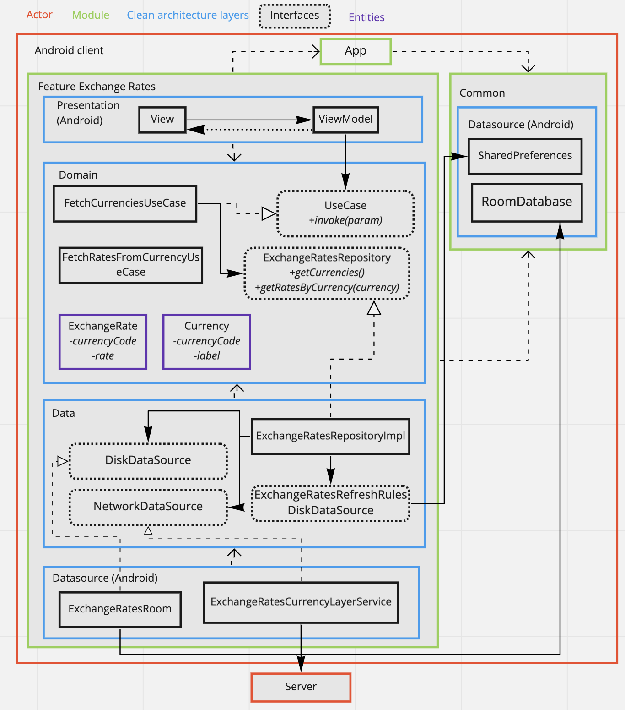

# PayPay Coding Challenge

Here is my solution for the coding challenge.

# Goal:
- Develop a Currency Conversion App that allows a user view exchange rates for any given currency

# Functional requirements:
- Exchange rates are fetched from: https://currencylayer.com/documentation
- I only used the free API Access Key for using the API. Therefore, there were some limitations to
access the complete API. For instance, getting the exchange rates of any currency other the USD was
not possible. In that case, what I did is getting the USD rates as a reference, then convert the USDXXX
to CurrencyXXX locally.
- User is able to select a currency from a list of currencies provided by the API. As there were no
other specification for this requirement, I decided to save locally this list so that this list
will never be retrieved from the server again (except if you reset the app data).
- User is able to enter desired amount for selected currency. I was not sure how to trigger the new
entered amount, so I decided to add a button next to the field in order to convert this amount
for the selected currency in the dropdown list. Another solution could have been to convert each time
the user changes the text field.
- User can see a list of exchange rates for the selected currency.
- Rates are persisted locally and refreshed no more frequently than every 30 minutes. I chose to
persist the rates every 30 minutes no matter which rate is being retrieved. So for instance, if the
user retrieves the USD rates, the countdown would start at this time, and if EUR rates are retrieved
within the 30 minutes, the countdown is not reset to 30 minutes.

# Technical notes:
- I chose feature based module in order to be able to scale the project with new features.
- I applied a "light" clean architecture with layers as shown in the graph below.
- Dependencies between layer are tested with ArchUnit.
- Please run "./gradlew test" for the unit tests.
- Dependency Injections are done with Dagger2.
- Databinding with LiveData are used for the presentation part.
- Coroutines are launch starting for the domain layer.
- I did not have the time to implement functional tests with Espresso, please apologize. If
It is required, then tell me and I can spend some time for it.

Please note that I did not go as deep as I would have for a real project in production because:
- of time limitation,
- this exercice is for demonstration purpose only,
- the project is too small.

# Simplified version of the global architecture:

